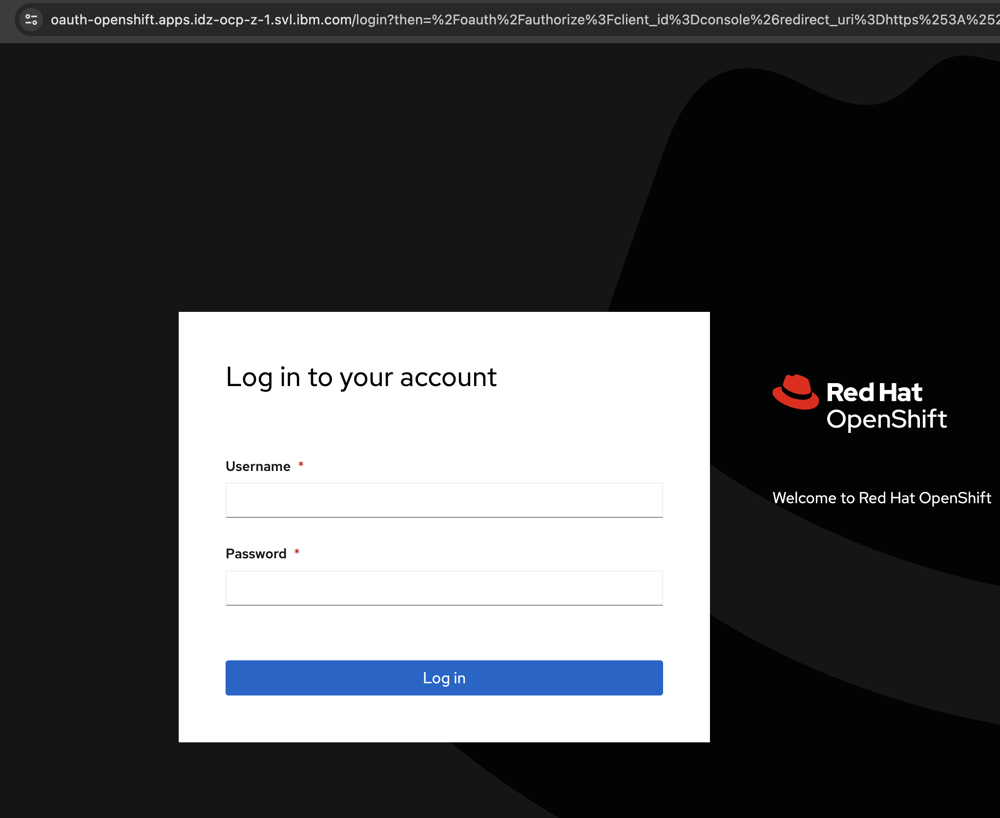

# Access web UI

### Step 1 : Log on to Load balancer VM : 9.30.200.145

### Step 2 : List the content of the kubeadmin-password from ocp-deploy directory

```bash
cat /root/ocp-install/ocp-deploy/auth/kubeadmin-password
```

### Step 3 : Access Openshfit Console
In your browser, go to: [https://console-openshift-console.apps.idz-ocp-z-1.svl.ibm.com/](https://console-openshift-console.apps.idz-ocp-z-1.svl.ibm.com/)

Note:  Username: kubeadmin and use password from step 2

