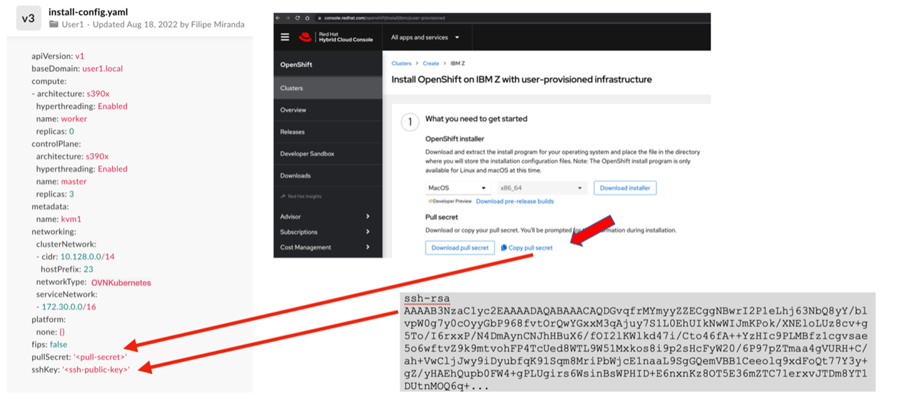

# Create the Red Hat OpenShift cluster

### 1 .Login to load balancer VM

Create the directories that will be used by the OpenShift Container Platform installation process

```bash
mkdir /var/www/html/ocp
mkdir /var/www/html/ignitions
mkdir /root/ocp-install
```

### 3 .Download the required files

```bash
cd /root/ocp-install
curl -o openshift-install.tar.gz 'https://mirror.openshift.com/pub/openshift-v4/s390x/clients/ocp/4.13.4/openshift-install-linux-4.13.4.tar.gz'
curl -o openshift-client-linux.tar.gz 'https://mirror.openshift.com/pub/openshift-v4/s390x/clients/ocp/4.13.4/openshift-client-linux-4.13.4.tar.gz'
```

### 4 .Download the rootfs file that is used for the creation of the Red Hat OpenShift cluster nodes.

```bash
cd /var/www/html/ocp
curl -o rhcos-installer-rootfs.s390x.img 'https://mirror.openshift.com/pub/openshift-v4/s390x/dependencies/rhcos/4.13/4.13.0/rhcos-installer-rootfs.s390x.img'
```

### 5 .Create a symbolic link to the file

```bash
ln -s rhcos-installer-rootfs.s390x.img rootfs.img
```

### 6 .Untar and unzip the downloaded files

 The openshift-client-linux.tar.gz file contains the client tools that will be used to interact with your cluster.

```bash
cd /root/ocp-install
tar zxvf openshift-client-linux.tar.gz

README.md
oc
kubectl
```

### 7 .Move the files that are extracted from the previous step to the **/usr/local/bin** to have access to these tools from your user path

```bash
mv oc /usr/local/bin
mv kubectl /usr/local/bin
```

### 8 .Prepare the openshift-install binary for the next steps of the Red Hat OpenShift installation.

```bash
cd /root/ocp-install
tar zxvf openshift-install.tar.gz
README.md
openshift-install
chmod +x openshift-install
```

### 9 .Create a directory to keep ocp-generated installation files

```bash
mkdir /root/ocp-install/ocp-deploy
```
### 10 .Copy the installation configuration file for Red Hat OpenShift 
copy [install-config.yaml](config/install-config.yaml)to **/root/ocp-install/ocp-deploy** directory

### 11 Add pull secret and SSH key

Edit two sections of the install-config.yaml file. The following image illustrates those steps, showing how to find the SSH key and the pull secret and where to add them.




#### 11.1 Generate the SSH key
Generate the SSH key in load balancer VM, which will be used to access nodes when Red Hat OpenShift is deployed

Generate the SSH key
```bash
ssh-keygen -t rsa -b 4096
```
copy the ssh-public-key 
```bash
cat ~/.ssh/id_rsa.pub
```
Ensure that in the **install-config.yaml** file, "ssh-public-key" variables is updated with the copied value enclosed in single quotation mark

#### 11.2 Get pull secret

 To access the pull secret, you must have a Red Hat account with a valid Red Hat OpenShift subscription

 We can also create a new account and use trial Liscence which will expire in 60 days

In install-config.yaml file, replace the values of the "pull-secret" with the correct values from the account [https://console.redhat.com/openshift/install/pull-secret](https://console.redhat.com/openshift/install/pull-secret)


### 12 Create Kubernetes manifest files

```bash
# create kubernetes manifests
./openshift-install create manifests --dir=/root/ocp-install/ocp-deploy
```

To set masters are not schedulable :

- Open the **manifests/cluster-scheduler-02-config.yml**file

- Locate the mastersSchedulable parameter and set its value to false

- Save and exit the file


### 13 Create ignition config files

```bash
# create ignition config files
./openshift-install create ignition-configs --dir=/root/ocp-install/ocp-deploy
```

Copy the files master.ign, worker.ign, and bootstrap.ign to **/var/www/html/ignitions/** in load balancer node where we have configured an HTTP server (Apache) to serve these files during the creation of the RHCOS VMs

```bash
cp /root/ocp-install/ocp-deploy/bootstrap.ign /root/ocp-install/ocp-deploy/master.ign /root/ocp-install/ocp-deploy/worker.ign  /var/www/html/ignitions/

chmod o+xr /var/www/html/ignitions/*.ign
```


