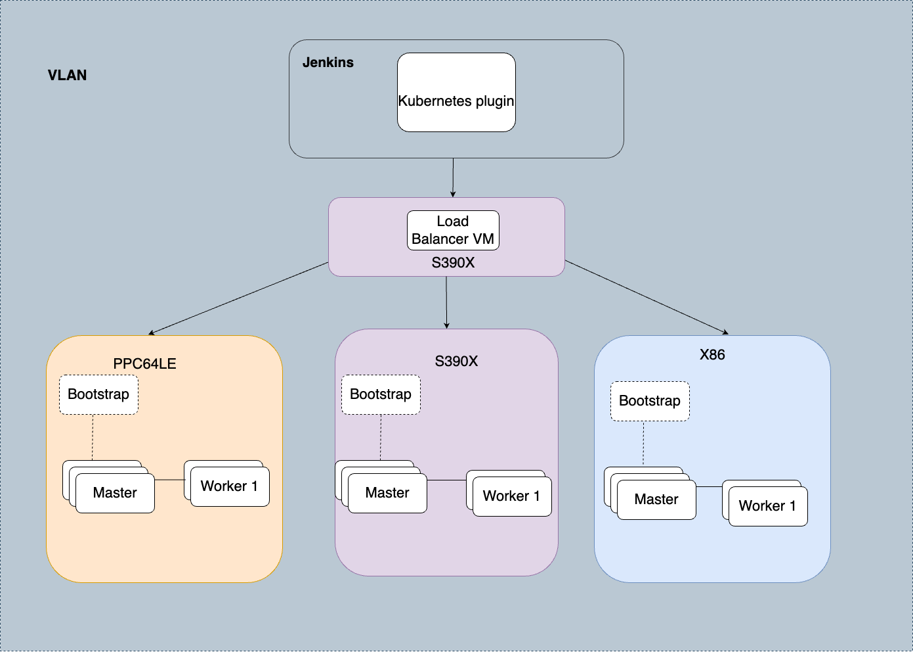

This guide will introduce how to use an OpenShift cluster installed on  Z as a Jenkins agent (slave) to manage build workloads.

# What is OpenShift?

OpenShift is an enterprise Kubernetes container orchestration platform by Red Hat, providing developers with the tools to deploy and manage containerized applications at scale. It extends Kubernetes with developer and operational tools that are integrated into a single platform, making it ideal for managing complex applications.

# Benefits of Using OpenShift on  Z as Jenkins Agents

As support for the current  Cloud Private (ICP) environment is ending, we must migrate our pipeline to OpenShift to leverage the following advantages:

- **Scalability**: OpenShift on  Z allows for scaling Jenkins agents dynamically based on workload demands.
- **Isolation**: Containers provide isolated environments for builds, ensuring consistency and reducing conflicts.
- **Resource Efficiency**:  Z's high performance and reliability combined with OpenShift's orchestration capabilities ensure efficient use of resources.
- **Flexibility**: The ability to run diverse workloads in a managed, consistent environment.

# OpenShift Container Platform 4

**Red Hat OpenShift Container Platform** builds on Red Hat Enterprise Linux to ensure consistent Linux distributions from the host operating system through all containerized function on the cluster. In addition to all these benefits, OpenShift also enhances Kubernetes by supplementing it with a variety of tools and capabilities focused on improving the productivity of both developers and IT Operations.

OpenShift Container Platform is a platform for developing and running containerized applications. OpenShift expands vanilla Kubernetes into an application platform designed for enterprise use at scale. Starting with the release of OpenShift 4, the default operating system is **Red Hat Enterprise Linux CoreOS (RHCOS)**, which provides an immutable infrastructure and automated updates.

**CoreOS** Container Linux, the pioneering lightweight container host, has merged with Project Atomic to become Red Hat Enterprise Linux (RHEL) CoreOS. RHEL CoreOS combines the ease of over-the-air updates from Container Linux with the Red Hat Enterprise Linux kernel to deliver a more secure, easily managed container host. RHEL CoreOS is available as part of Red Hat OpenShift.

# OpenShift Container Platform Installation on S390X

Installing OpenShift Container Platform on  Z with PR/SM (Processor Resource/Systems Manager), LPAR (Logical Partitioning), RHEL (Red Hat Enterprise Linux), and KVM (Kernel-based Virtual Machine) virtualization is a complex but powerful setup that allows you to run containerized applications on 's mainframe platform. 

Below is the architecture diagram illustrating the integration between Jenkins and OpenShift cluster

