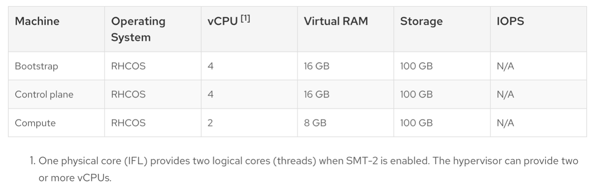
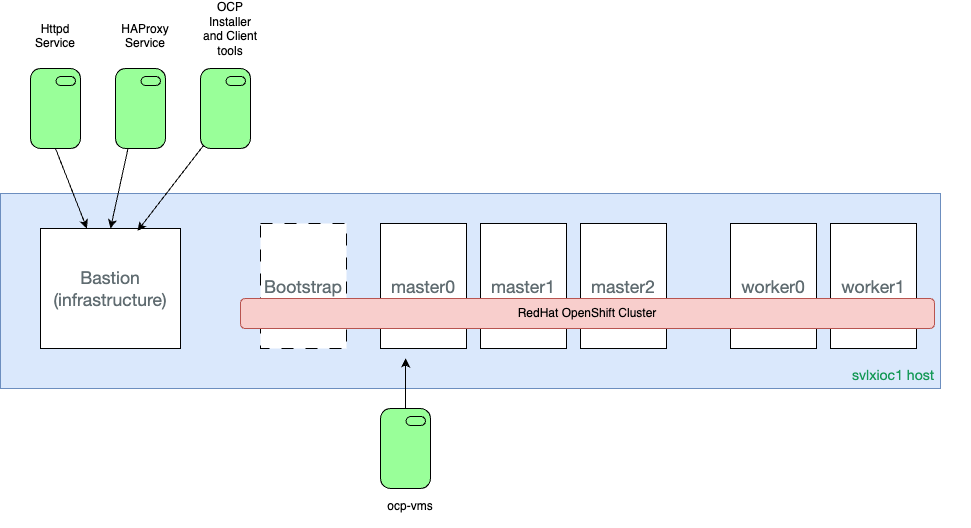

## Prerequisites

we use the minimum requirements to get our environment up and running. For production or performance testing, please refer to the preferred configuration from the official Red Hat documentation. [OpenShift Installation on IBM Z](https://docs.openshift.com/container-platform/4.8/installing/installing_ibm_z/installing-ibm-z.html)

The minimum configuration requirements for a cluster with user-provisioned infrastructure (UPI) using a connected installation are as follows:

- One temporary bootstrap node
- Three control plane (or master) nodes
- At least two compute plane (or worker) nodes
- One Bastion (infrastructure) node (recommended)
- A valid subscription of the Red Hat OpenShift cluster for IBM zSystems

The bootstrap node, control plane nodes (often called masters), and compute plane nodes (often called workers) must use Red Hat Enterprise CoreOS (RHCOS) as the underlying operating system (OS) layer. As for the Bastion node, it is recommended to use Red Hat Enterprise Linux (RHEL) which is the entitlement that's provided as part of the RHOCP subscription.

All nodes that form an OpenShift cluster using the UPI deployment model, require network access to the HTTP server (which usually runs on the Bastion node). During the OpenShift Container Platform installation process, nodes attempt to fetch the Ignition config files (master, worker, or bootstrap) as well as the RHCOS image (rootfs) from the HTTP server. The virtual machines under z/VM are configured with static IP addresses. No DHCP server is used. 

### Hardware requirements

Minimum resource requirements
Figure 1. Minimum requirements for Red Hat OpenShift Container Platform 4.12

Prerequisites: minimum requirements

Minimum hardware requirements:

- 1 logical partition (LPAR) with 6 IFLs (SMT2 enabled)
- 1 OSA or RoCE network adapter

## Environment

Each KVM guest accesses a KVM network bridge set up as macvtap that enables all nodes of this Red Hat OpenShift cluster to be on the same network range as the KVM host

**Note: In this network configuration, the KVM host (IBMZ server) does not have network access to any of the KVM guests (master/worker/infrastructure vms). This is why it is important to access your KVM guests from  workstation, not the KVM host(IBMZ server)**

